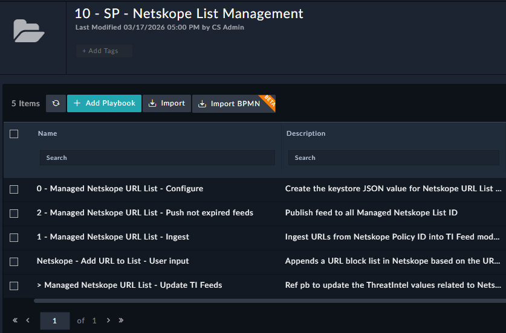
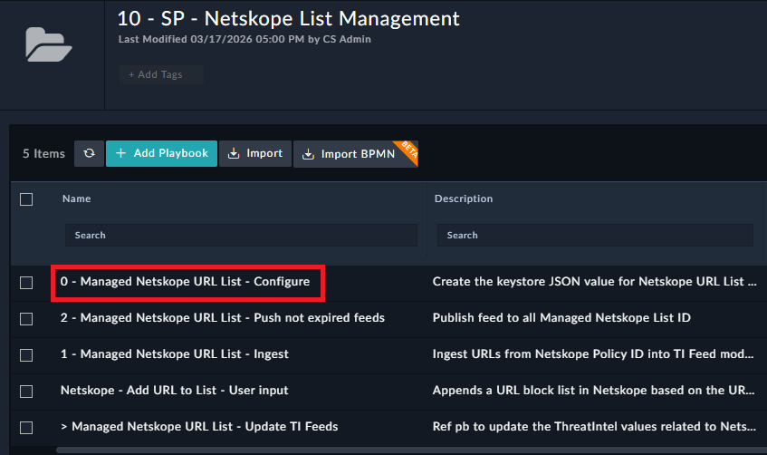
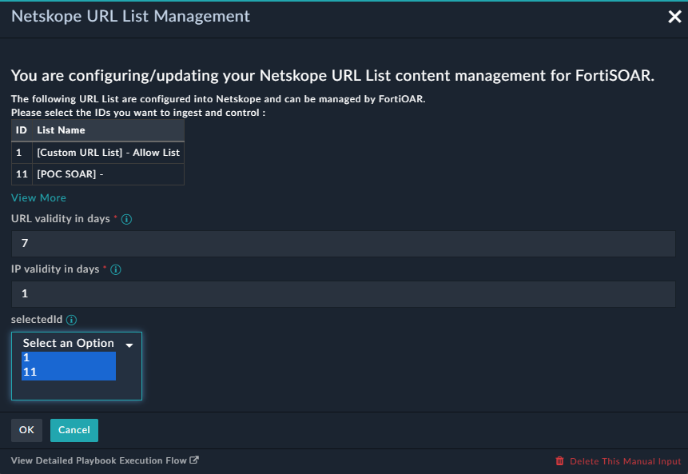
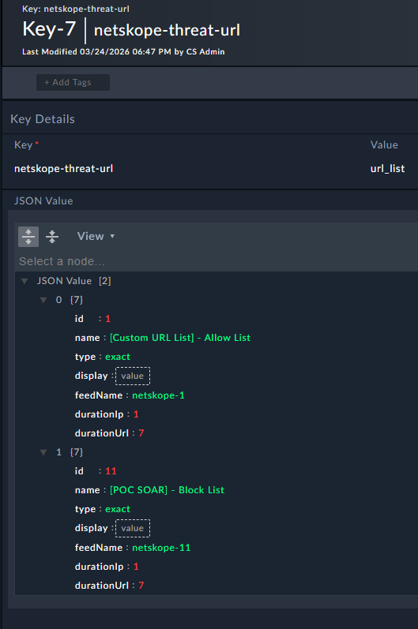
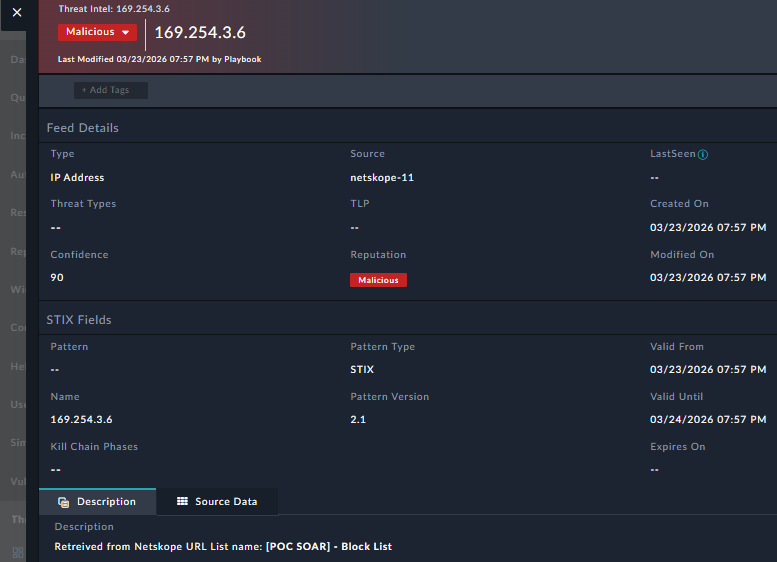
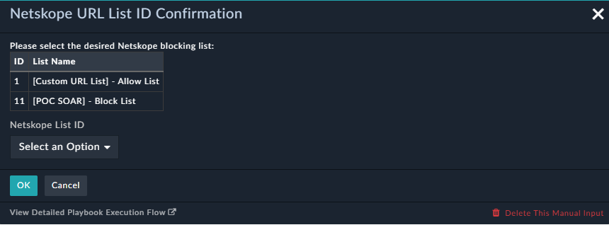

| [Home](../README.md) |
|----------------------|

# Installation

Install the Solution Pack. This is an example screenshot and what you see in the content hub may defer in version and details. 

The Playbooks are installed in "10 - SP - Netskope List Management"

# Configuration
 
1- Open and start the playbook : "0 - Managed Netskope URL List - Configure"

2- Make your choice 
   - Select in the list the IDs you want to manage with FortiSOAR
   - Define the IP end of life duration
   - Define the URL end of life duration
 

   - As a result FortiSOAR will create the key "netskope-threat-url" in the "Key Store" module to store your configuration.

4- Open and start the playbook : "1 - Managed Netskope URL List - Ingest"

This playbook will fetch the selected Netskope list ID objects and create records with an end of life duration (valid until).

5- Schedule once per day the playbook: "2 - Managed Netskope URL List - Push not expired feeds"
   - Create a new schedule to execute the playbook once per day.

This playbook will maintain the Netskope URL list with the valid objects based on the "valid until" parameter.

# Usage

When you want to blok a new URL into Netskope, you can use the playbook "Netskope - Add URL to List - User input". You will be prompted to select the URL List ID to add the object to.

| [Installation](./setup.md#installation) | [Configuration](./setup.md#configuration) | [Usage](./setup.md#usage) |
|-----------------------------------------|-------------------------------------------|---------------------|
