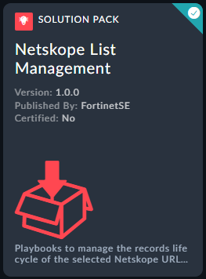

| [Home](../README.md) |
|----------------------|

# Installation

Install the Solution Pack. This is an example screenshot and what you see in the content hub may defer in version and details. 

# Configuration
 
- Open and start the playbook : 0 - Managed Netskope URL List - Configure
   - Select in the list the IDs you want to manage with FortiSOAR
   - Define the IP end of life duration
   - Define the URL end of life duration
 

- Open and start the playbook : 1 - Managed Netskope URL List - Ingest
   - This playbook will fetch the selected Netskope list ID objects and create records with an end of life duration (valid until)
- Schedule once per day the playbook: 2 - Managed Netskope URL List - Push not expired feeds
   - This playbook will select and push the not expired IOCs for each Managed URL List and Apply the changes in Netskope.
the records life cycle of the selected Netskope URL list IDs based on URL and IPs record validity duration. 

| [Installation](./setup.md#installation) | [Configuration](./setup.md#configuration) | [Usage](./usage.md) |
|-----------------------------------------|-------------------------------------------|---------------------|
